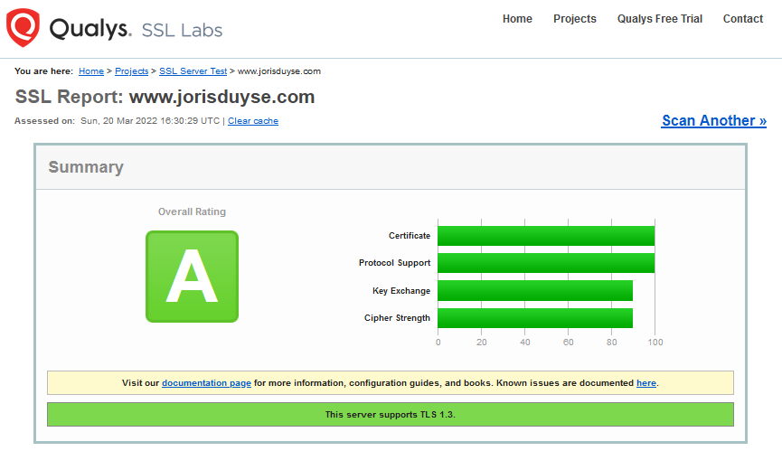

# Documentatie Apache Web Server opzetten in virtuele machine en deployment op ubuntu server

| Documentatie type | Link |
| ----------- | ----------- |
| Online markdown documentation | [github.com](https://github.com/JorisVanDuyseHogent/SystemEngineeringLab/tree/main/ApacheWebServer#readme) |
| Online pdf documentation | [github.com](https://github.com/JorisVanDuyseHogent/SystemEngineeringLab/blob/main/ApacheWebServer/ApacheWebServerG56.pdf) |

## Table of Contents

- [Documentatie Apache Web Server opzetten in virtuele machine en deployment op ubuntu server](#documentatie-apache-web-server-opzetten-in-virtuele-machine-en-deployment-op-ubuntu-server)
  - [Table of Contents](#table-of-contents)
  - [Ubuntu desktop in Virtual box](#ubuntu-desktop-in-virtual-box)
  - [Ubuntu server on Bare-metal](#ubuntu-server-on-bare-metal)
    - [Niewe user aanmaken voor de webserver](#niewe-user-aanmaken-voor-de-webserver)
    - [Installatie Apache Web Server](#installatie-apache-web-server)
      - [Verwijderen van nginx](#verwijderen-van-nginx)
    - [Portforwarding Apache2](#portforwarding-apache2)
    - [Installatie van website voorbeeld](#installatie-van-website-voorbeeld)
    - [Http to Https with SSL](#http-to-https-with-ssl)
      - [Self signed SSL](#self-signed-ssl)
        - [Self Signed SSL verbinding testen](#self-signed-ssl-verbinding-testen)
        - [Extra informatie SSL certificaat](#extra-informatie-ssl-certificaat)
    - [SSL Certificaat met letsEncrypt](#ssl-certificaat-met-letsencrypt)
      - [Installatie Certbot](#installatie-certbot)
    - [Eind resultaat](#eind-resultaat)

## Ubuntu desktop in Virtual box

Moet nog worden bijgewerkt

## Ubuntu server on Bare-metal

### Niewe user aanmaken voor de webserver

```bash
su #login to root user
adduser webserverg56
```

```bash
$ cat /etc/passwd | grep webserverg56 
webserverg56:x:1002:1002:,,,:/home/webserverg56:/bin/bash
```

```bash
usermod -aG sudo webserverg56
su - webserverg56
```

### Installatie Apache Web Server

```bash
sudo apt install apache2 -y
```

```bash
$ systemctl status apache2
● apache2.service - The Apache HTTP Server
     Loaded: loaded (/lib/systemd/system/apache2.service; enabled; vendor preset: enabled)
     Active: failed (Result: exit-code) since Fri 2022-03-18 16:32:58 UTC; 14s ago
       Docs: https://httpd.apache.org/docs/2.4/
```


Na installatie en bij het runnen van systemctl status wordt duidelijk dat de server nog niet actief is.
Het probleem kon verholpen worden door nginx te verwijderen, hierdoor kwam poort 80 vrij; en kon apache2 gewoon worden geinsalleerd.

```bash
Mar 18 20:41:11 cplex apachectl[9167]: (98)Address already in use: AH00072: make_sock: could not bind to address [::]:80
Mar 18 20:41:11 cplex apachectl[9167]: (98)Address already in use: AH00072: make_sock: could not bind to address 0.0.0.0:80
```

#### Verwijderen van nginx

```bash
lsof -i :80 #see what application is using port 80
sudo apt purge nginx nginx-common #for me nginx was using port 80 (not in use anymore)
systemctl stop apache2 #restart doesn't work
systemctl start apache2
systemctl status apache2
```


### Portforwarding Apache2

Apache2 gebruikt nu poort 80. Dus deze moeten we nu via onze ISP gaan open zetten.

```bash
$ lsof -i :80
COMMAND   PID     USER   FD   TYPE DEVICE SIZE/OFF NODE NAME
apache2 11933     root    4u  IPv6 131563      0t0  TCP *:http (LISTEN)
apache2 11934 www-data    4u  IPv6 131563      0t0  TCP *:http (LISTEN)
apache2 11935 www-data    4u  IPv6 131563      0t0  TCP *:http (LISTEN)
```


*"Portforwarding van poort 80 voor apache2 (3306 en 22 voor sql-server en ssh)"*


*"Benaderen van jorisduyse.com"*

### Installatie van website voorbeeld

```bash
$ ls
index.html  index.nginx-debian.html
$ sudo rm index.html | sudo rm index.nginx-debian.html #remove autogenerated index.html
```

```bash
$ sudo git clone https://github.com/bsclub/bsclub.github.io.git #clone old website example
Cloning into 'bsclub.github.io'...
remote: Enumerating objects: 342, done.
remote: Counting objects: 100% (342/342), done.
remote: Compressing objects: 100% (294/294), done.
remote: Total 342 (delta 49), reused 341 (delta 48), pack-reused 0
Receiving objects: 100% (342/342), 2.98 MiB | 16.78 MiB/s, done.
Resolving deltas: 100% (49/49), done.
```

```bash
$ ls #oops forgot about folder creation with git
bsclub.github.io  design.css  Fonts  Images  index.html  register.html
$ cd bsclub.github.io/
webserverg56@cplex:/var/www/html/bsclub.github.io$ sudo mv ./* ../
webserverg56@cplex:/var/www/html/bsclub.github.io$ cd ..
$ sudo rm -r ./bsclub.github.io/

$ ls #done!
bsclub.github.io  design.css  Fonts  Images  index.html  register.html
```

Eens een kijkje nemen naar de pagina die nu online staat!


### Http to Https with SSL

Http &#128275; to Https &#128274; with SSL

#### Self signed SSL

```bash
$ sudo a2enmod ssl #enable the ssl service if not allready enabled
Considering dependency setenvif for ssl:
Module setenvif already enabled
Considering dependency mime for ssl:
Module mime already enabled
Considering dependency socache_shmcb for ssl:
Enabling module socache_shmcb.
Enabling module ssl.
See /usr/share/doc/apache2/README.Debian.gz on how to configure SSL and create self-signed certificates.
To activate the new configuration, you need to run:
  systemctl restart apache2
```

```bash
sudo service apache2 restart #restart apache2 for changes to take effect
```

Eerst maken we een backup van */etc/apache2/sites-available/default-ssl.conf*

```bash
sudo cp default-ssl.conf default-ssl.conf_back
```

We voegen volgende lijnen to aan het configuratie bestand */etc/apache2/sites-available/default-ssl.conf* onder **\<VirtualHost \_default_:443>**

```txt
ServerName jorisduyse.com
DocumentRoot /var/www/html
```

En onder **SSLEngine on** voegen we toe:
(Deze bestanden moeten uiteraard nog aangemaakt worden)

```txt
SSLCertificateFile      /etc/apache2/ssl/jorisduyse.com.crt
SSLCertificateKeyFile   /etc/apache2/ssl/jorisduyse.com.key
```

```bash
$ sudo mkdir /etc/apache2/ssl/sudo openssl req -x509 -nodes -days 365 -newkey rsa:2048 -
keyout /etc/apache2/ssl/jorisduyse.com.key -out /etc/apache2/ssl/jorisduyse.com.crt
Generating a RSA private key
#**removed**
#**removed**
writing new private key to '/etc/apache2/ssl/jorisduyse.com.key'
-----
You are about to be asked to enter information that will be incorporated
into your certificate request.
What you are about to enter is what is called a Distinguished Name or a DN.
There are quite a few fields but you can leave some blank
For some fields there will be a default value,
If you enter '.', the field will be left blank.
-----
Country Name (2 letter code) [AU]:BE
State or Province Name (full name) [Some-State]:Oost-Vlaanderen
Locality Name (eg, city) []:Gent
Organization Name (eg, company) [Internet Widgits Pty Ltd]:jorisduyse
Organizational Unit Name (eg, section) []:jorisduyse
Common Name (e.g. server FQDN or YOUR name) []jorisduyse.com
Email Address []:jorisduyse@protonmail.com
```


*"We schakelen de custom config file in en de oud die we voor http gebruikten uit"*


*"Aangezien we een https verbinding willen maken en de http willen laten vallen kunnen we poort 80 weer sluiten"*

##### Self Signed SSL verbinding testen

Helaas gaat de browser nogsteeds klagen aangezien de SSL self-sigend is en dus niet "officieel" herkent wordt maar https is wel ingeschakeld.


*"Browser klaagt over self-signed site"*


##### Extra informatie SSL certificaat


*"SSL certificaat informatie"*


*"Volledig SSL certificaat"*

### SSL Certificaat met letsEncrypt

#### Installatie Certbot

```bash
sudo apt-get install certbot python3-certbot-apache -y
```

```bash
sudo cerbot --apache
```

Bij het uitvoeren van dit commando verschijnt er echter een error. Dit komt omdat we de virtual host van poort 80 hadden verwijdert in de config file. Na deze terug te plaatsen werd de error verholpen.

```text
Unable to find a virtual host listening on port 80 which is currently needed for Certbot to prove to the CA that you control your domain.
Please add a virtual host for port 80.
```

```text
1: No redirect - Make no further changes to the webserver configuration.
2: Redirect - Make all requests redirect to secure HTTPS access. Choose this for
new sites, or if you're confident your site works on HTTPS. You can undo this
change by editing your web server's configuration.
- - - - - - - - - - - - - - - - - - - - - - - - - - - - - - - - - - - - - - - -
Select the appropriate number [1-2] then [enter] (press 'c' to cancel): 2
```

De Certbot die in python geschreven is &#128525;! Past de config files aan in /etc/apache2 zodat ze verwijzen naar een zelf gegenereerde file: `Redirecting vhost in /etc/apache2/sites-enabled/default-ssl.conf to ssl vhost in /etc/apache2/sites-enabled/default-ssl.conf`
Een test van onze SSL vind je [hier](https://www.ssllabs.com/ssltest/analyze.html?d=www.jorisduyse.com).




```text
-----BEGIN CERTIFICATE-----
MIIFKjCCBBKgAwIBAgISBHlMT9r4arJ9J443rTkyRqlIMA0GCSqGSIb3DQEBCwUAMDIxCzAJBgNV
BAYTAlVTMRYwFAYDVQQKEw1MZXQncyBFbmNyeXB0MQswCQYDVQQDEwJSMzAeFw0yMjAzMjAxNTIz
NTVaFw0yMjA2MTgxNTIzNTRaMB0xGzAZBgNVBAMTEnd3dy5qb3Jpc2R1eXNlLmNvbTCCASIwDQYJ
KoZIhvcNAQEBBQADggEPADCCAQoCggEBANq+YW84cOd5ISsDGXvMvVWCOYmsQW59V2E0jP/XIO1E
H5hDu1L5VkKB0RRp3xq2OCinJza4d5yVldPGiL12MdriFUq2VXbVRScHbeCGFSIwmgwduMy3Gf4F
9KSqoPMBY2XyXLFxiunAaBJV+8XCQos0nSMdNXG9OtDvcodkTXpGMW96PAP1KX/tu1X0ukcypelL
r4B6SFQoY9eza1QZw5gBMXTwX2STd462E1ciVFhyt7oQsMQQVisCLLB6edsLaMX7WKKSlG1Emmal
JT8JU3fAkDwH6sDjDOd/5oHoGTp7XrISeBFLLfef5MrAmqYuAzNOwylwYlrRmXDk/t/pdqUCAwEA
AaOCAk0wggJJMA4GA1UdDwEB/wQEAwIFoDAdBgNVHSUEFjAUBggrBgEFBQcDAQYIKwYBBQUHAwIw
DAYDVR0TAQH/BAIwADAdBgNVHQ4EFgQU6X44VQL6ksUSjz2PEN6fgl+raXEwHwYDVR0jBBgwFoAU
FC6zF7dYVsuuUAlA5h+vnYsUwsYwVQYIKwYBBQUHAQEESTBHMCEGCCsGAQUFBzABhhVodHRwOi8v
cjMuby5sZW5jci5vcmcwIgYIKwYBBQUHMAKGFmh0dHA6Ly9yMy5pLmxlbmNyLm9yZy8wHQYDVR0R
BBYwFIISd3d3LmpvcmlzZHV5c2UuY29tMEwGA1UdIARFMEMwCAYGZ4EMAQIBMDcGCysGAQQBgt8T
AQEBMCgwJgYIKwYBBQUHAgEWGmh0dHA6Ly9jcHMubGV0c2VuY3J5cHQub3JnMIIBBAYKKwYBBAHW
eQIEAgSB9QSB8gDwAHYA36Veq2iCTx9sre64X04+WurNohKkal6OOxLAIERcKnMAAAF/qCRz5gAA
BAMARzBFAiBWQo9bwo/O+0+TIApBYu2w2Jv73ulmmk1Iqd0lbrajhQIhALomLdWDmAOwCy5tS0oZ
BBs3JfWpm/MHnHCAkhzhEqb0AHYARqVV63X6kSAwtaKJafTzfREsQXS+/Um4havy/HD+bUcAAAF/
qCR0CwAABAMARzBFAiEAjHQ/vTQhRzABSb+1VrPhNTlh8PKA9tN4WGXVV8w6tncCIGJcH+r6Uxi9
DQDO1sjJeowwEh47A2bPuKolqaPdls10MA0GCSqGSIb3DQEBCwUAA4IBAQBB+M8LyR/M/8cMG+it
bLpl+wXao474ot+yCVGCvAvImS7domYwDWCq7VmAX87l/Xip3fa3YwWMpSmRXMaBtClUEdcNfqRl
bJE4ZJi83xP2WBNpBykG3ueC6s7ARUVNO7Xp8Swst9s12KKhwzlu39WJwSPzb7g2cYhr+o3riCkE
6QC/fX4ALhs1cqLySd6LT7L7lETAVI3fyC6fsjhlbAhVlJIsTeh+e5OeS/wWInsr7hwemjxP5KDy
8NW6lsEZ7tA7QGdjcvbfthMomP2Y06XAcdU4M9Qnu6SLJBBwg+0jYPpVGb0a39fcyxis61YHCQ1o
0MZ54glG1FX6PXAwd5ns
-----END CERTIFICATE-----
```

### Eind resultaat


*"Website met let's encrypt certificaat"*


