# Documentatie Database server opzetten in virtuele machine en deployment op ubuntu server

| Documentatie type | Link |
| ----------- | ----------- |
| Online markdown documentation | [github.com](https://github.com/JorisVanDuyseHogent/SystemEngineeringLab/tree/main/DatabaseServer#readme) |
| Online pdf documentation | [github.com](https://github.com/JorisVanDuyseHogent/SystemEngineeringLab/blob/main/DatabaseServer/uitvoering.pdf) |

## Table of Contents

- [Documentatie Database server opzetten in virtuele machine en deployment op ubuntu server](#documentatie-database-server-opzetten-in-virtuele-machine-en-deployment-op-ubuntu-server)
  - [Table of Contents](#table-of-contents)
  - [Ubuntu desktop "Virtual Box"](#ubuntu-desktop-virtual-box)
  - [Ubuntu server "Virtual Box"](#ubuntu-server-virtual-box)
    - [Commando ss -tlnp](#commando-ss--tlnp)
  - [Ubuntu server "Bare-metal"](#ubuntu-server-bare-metal)
    - [Port forwarding](#port-forwarding)
    - [Dynamic DNS Service](#dynamic-dns-service)
    - [Bind adress config file](#bind-adress-config-file)

## Ubuntu desktop "Virtual Box"

Ubuntu desktop installatie op Virtual Box
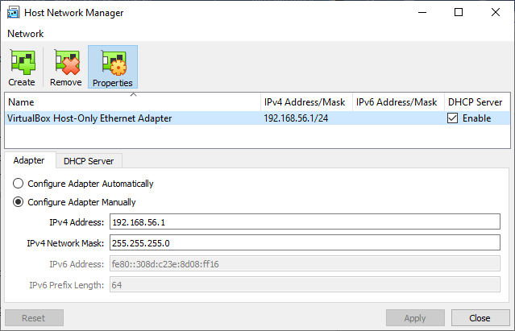
*"Host Network instellingen"*

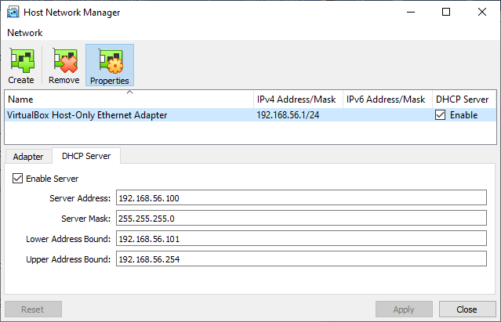
*"DHCP netwerk instellingen"*

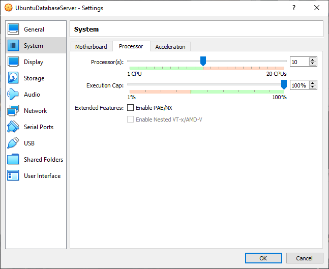
*"Virtual machine cpu core allocation"*

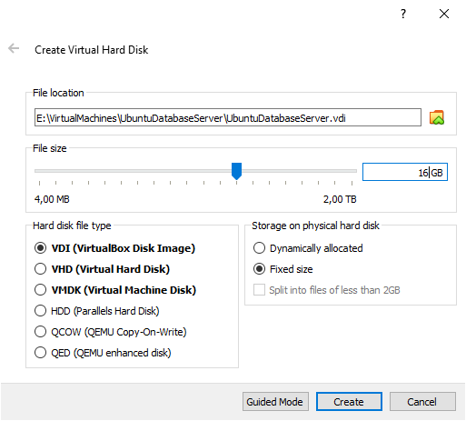
*"Disk allocation (fixed size voor betere performance)"*

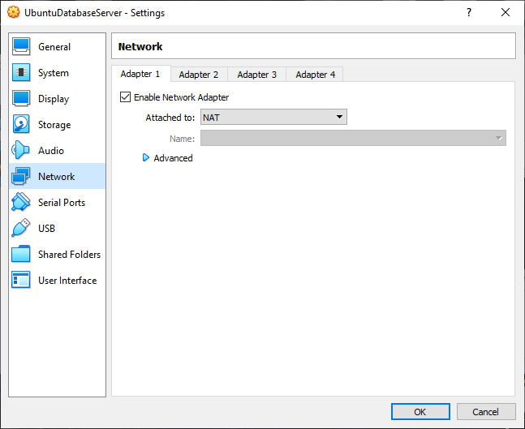
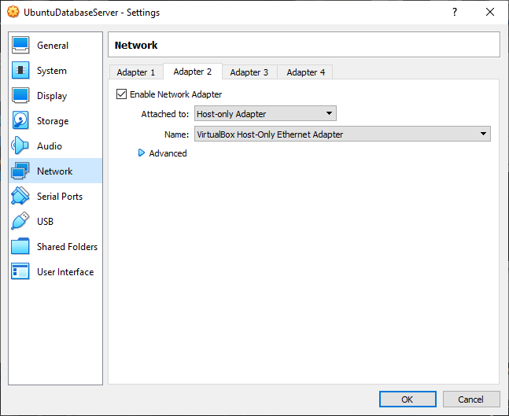

`mysql -uadmin -h192.168.56.101 -pletmein`
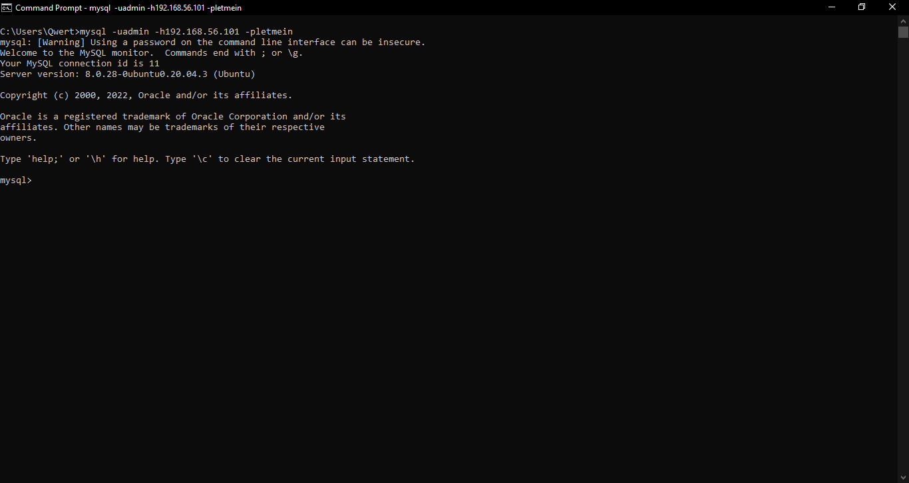\
*"Verbinding met mysql-server via cmd op host pc naar virtuele machine."*

## Ubuntu server "Virtual Box"

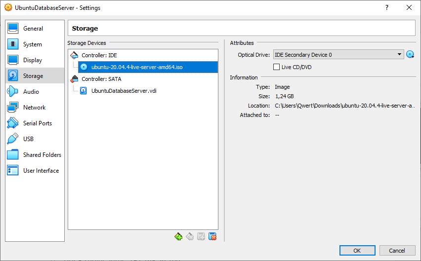
*"Boot device voor Ubuntu Server"*

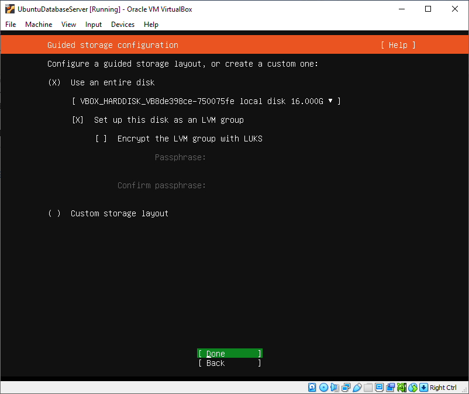
*"Disk settings voor ubuntu server"*

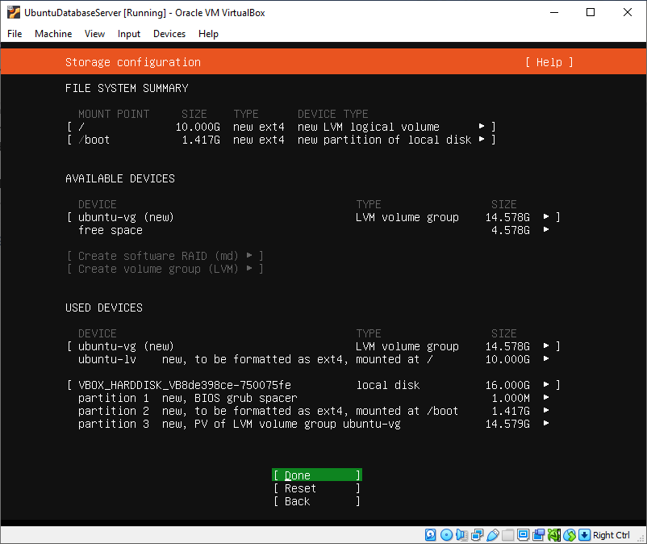
*"File system instellingen"*

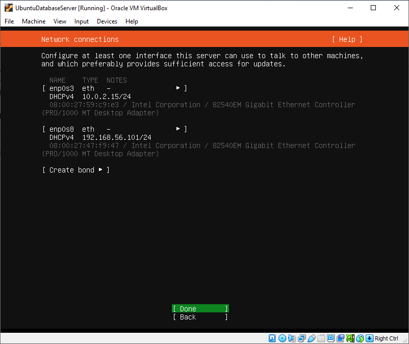
*"Netwerk connections (werden automatisch ingevuld)"*

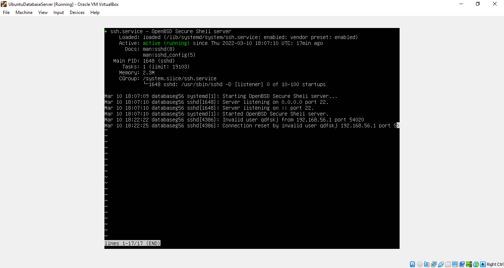
*"systemctl status ssh.service"*

### Commando ss -tlnp

Met het commando sudo ss -tlnp kunnen we de poorten laten zien waar processen gebruik van maken. Ook wordt het ip4 adres weergegeven die in verbinding staan met de aangewezen poort.

```bash
sudo ss -tlnp
```

Ook zichtbaar zijn de commando's die werden gebruikt voor de configuratie van de mysql server.
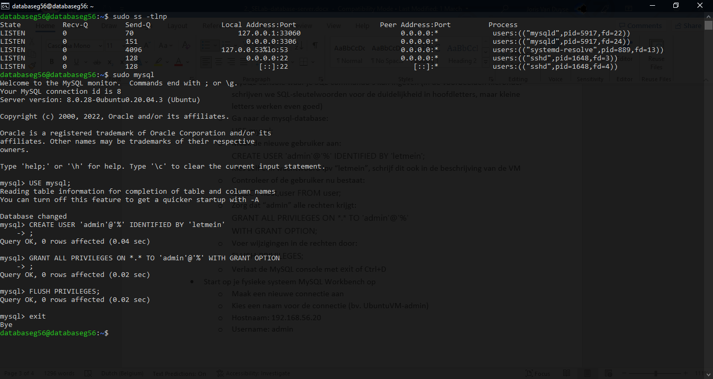

## Ubuntu server "Bare-metal"

Na het uitvoeren van de opdracht in een virtuele omgeving besloten we om deze nu eens verder uit te werken op een ubuntu server omgeving die "bare-metal" draait.
Deze server had ik al reeds gemaakt dus de installatie is niet gedocumenteerd.

### Port forwarding

We openen twee tcp poorten naar de ubuntu server. Poort 22 voor de secure shell; poort 3306 voor de sql server.
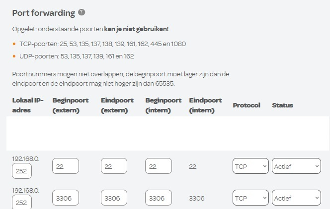
*"tcp poort 22 en 3306 open"*

### Dynamic DNS Service

Door het ip4 adres van ISP te verbinden met een DNS kan de server makkelijker benadert worden. In dit geval gebruiken we dynu.com voor ons domein naam.

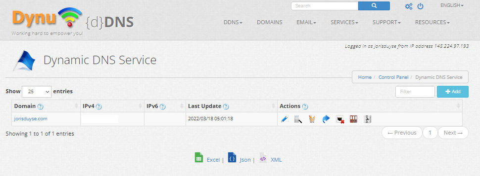
*"Gebruik DNS jorisduyse.com"*

```bash
ssh databaseg56@jorisduyse.com
```

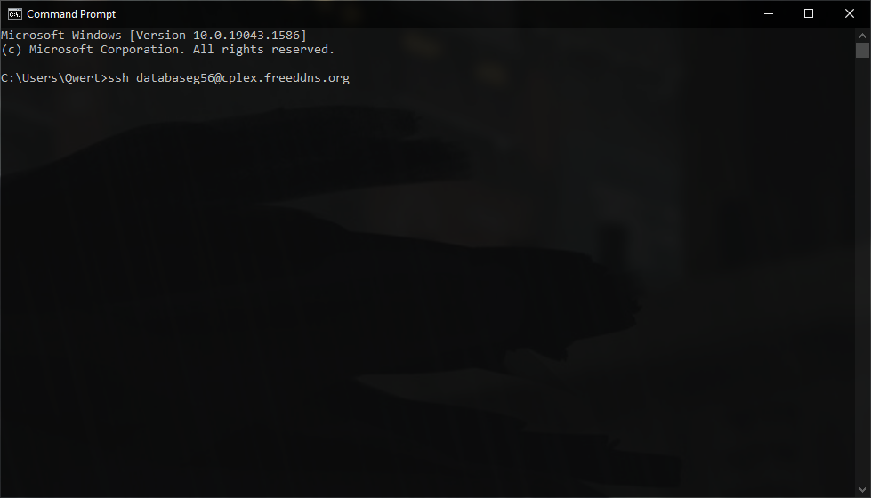
*"ssh commando naar database server (host adres reeds aangepast naar jorisduyse.com"*

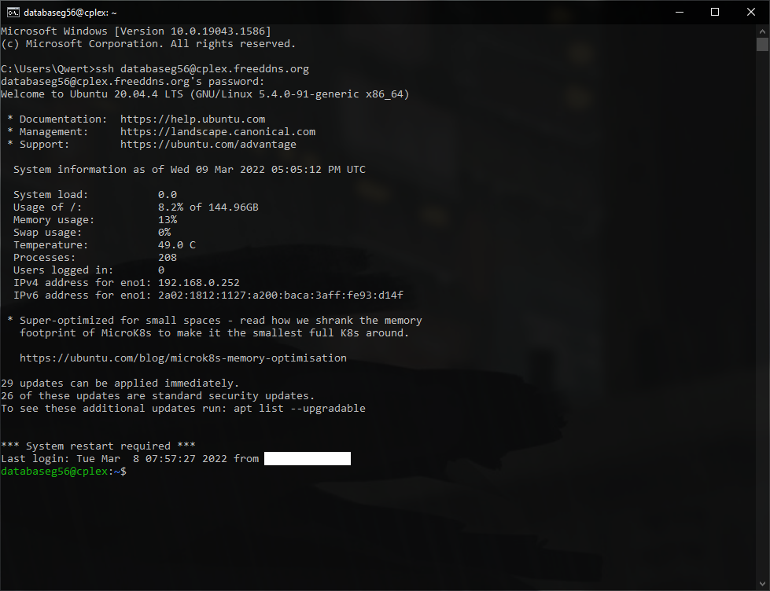
*"Verbinding met ssh server"*

### Bind adress config file

Door het bindadress in te stellen op 0.0.0.0, luisterd de mysql-server niet alleen naar een locale verbinding (127.0.0.1). Hierdoor kan de server benadert worden door apparaten op het netwerk.

```bash
sudo nano /etc/mysql/mysql.conf.d/mysqld.cnf
```

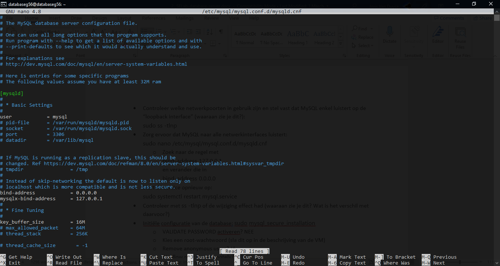

```bash
systemctl status mysql
```

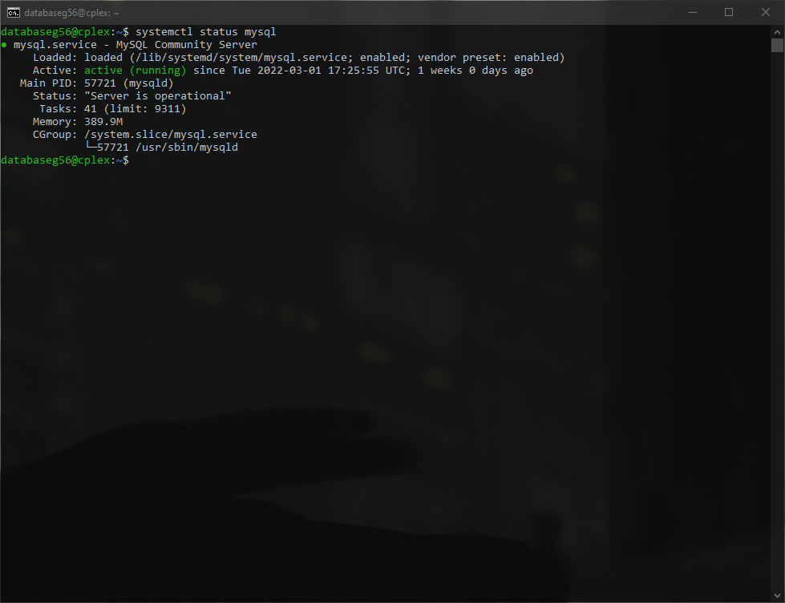
*"commando systemctl status mysql"*

```bash
sudo ss -tlnp
```

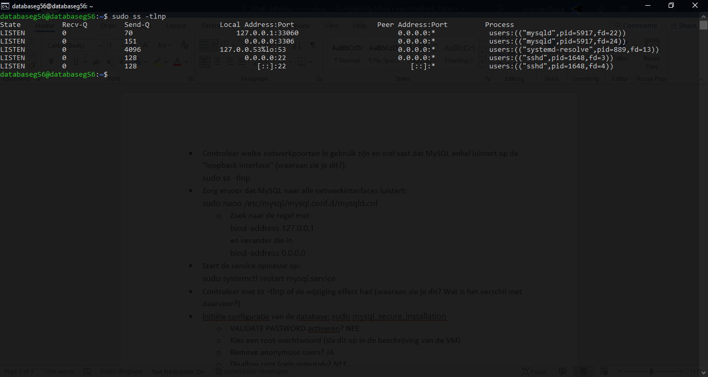
*"Commando ss -tlnp op bare-metal server"*
