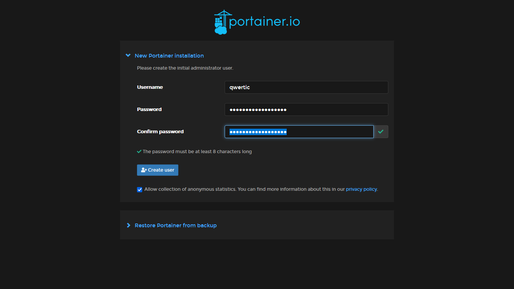

# Docker 

## HowTo's

```bash

docker run -d -p [port:port] --name [container_short_name] --restart=[always] -v [docker .sock location] -v [file_location] #create docker container
docker [start / stop] [container_name] #start / stop specific   docker container
```

## Installing docker on Ubuntu Server LTS 20.04

```bash
sudo apt upgrade -y # update befor installing anything
sudo apt-get remove docker docker-engine docker.io containerd runc #uninstall previous docker version / files
```

```bash
 sudo apt-get install apt-transport-https ca-certificates curl gnupg-agent software-properties-common # install dependencies for install process
```

Adding Docker official GPG key

```bash
sudo curl -fsSL https://download.docker.com/linux/ubuntu/gpg | sudo apt-key add -
```

```bash
sudo apt-get update
sudo apt-get install docker-ce docker-ce-cli containerd.io
```

```bash
sudo add-apt-repository "deb [arch=amd64] https://download.docker.com/linux/ubuntu $(lsb_release -cs) stable" #add docker repository
```

## User and group settings

```bash
sudo groupadd docker #if it doesn't exist allready
sudo usermod -aG docker $USER
newgrp docker #apply changes and refresh for current user 
docker run hello-world #running docker without sudo

Hello from Docker!
This message shows that your installation appears to be working correctly.
```

[On Debian and Ubuntu, the Docker service is configured to start on boot by default.](https://docs.docker.com/engine/install/linux-postinstall/#configure-docker-to-start-on-boot)

## Installing vaultWarden

```bash 
docker pull vaultwarden/server:latest
sudo docker run -d --name vaultwarden -v /srv/vaultwarden:/data -e WEBSOCKET_ENABLED=true -p 127.0.0.1:8080:80 -p 127.0.0.1:3012:3012 --restart on-failure vaultwarden/server:latest
```

~~## Installing caddy for reversed proxy~~ FAILED

```bash
sudo docker pull caddy:2
```

The caddy config file located at ```/etc/caddy/```

```text
jorisduyse.com {
  encode gzip

  # The negotiation endpoint is also proxied to Rocket
  reverse_proxy /notifications/hub/negotiate 0.0.0.0:80

  # Notifications redirected to the websockets server
  reverse_proxy /notifications/hub 0.0.0.0:3012

  # Send all other traffic to the regular Vaultwarden endpoint
  reverse_proxy 0.0.0.0:80
}
```

Create Docker container for caddy with config file from ```/etc/caddy/```

```bash
docker run -d -p 80:80 -p 443:443 --name caddy -v /etc/caddy/Caddyfile:/etc/caddy/Caddyfile -v /etc/caddy:/root/.local/share/caddy --restart on-failure caddy:2
```

```bash
qwertic@cplex:~$ sudo docker logs caddy
{"level":"info","ts":1650816039.9069374,"msg":"using provided configuration","config_file":"/etc/caddy/Caddyfile","config_adapter":"caddyfile"}
{"level":"warn","ts":1650816039.9078312,"msg":"input is not formatted with 'caddy fmt'","adapter":"caddyfile","file":"/etc/caddy/Caddyfile","line":2}
{"level":"info","ts":1650816039.9092925,"logger":"admin","msg":"admin endpoint started","address":"tcp/localhost:2019","enforce_origin":false,"origins":["localhost:2019","[::1]:2019","127.0.0.1:2019"]}
{"level":"info","ts":1650816039.9094636,"logger":"http","msg":"server is listening only on the HTTPS port but has no TLS connection policies; adding one to enable TLS","server_name":"srv0","https_port":443}
{"level":"info","ts":1650816039.9094784,"logger":"http","msg":"enabling automatic HTTP->HTTPS redirects","server_name":"srv0"}
{"level":"info","ts":1650816039.909538,"logger":"tls.cache.maintenance","msg":"started background certificate maintenance","cache":"0xc000454150"}
{"level":"info","ts":1650816039.909935,"logger":"tls","msg":"cleaning storage unit","description":"FileStorage:/data/caddy"}
{"level":"info","ts":1650816039.9099705,"logger":"tls","msg":"finished cleaning storage units"}
{"level":"info","ts":1650816039.909989,"logger":"http","msg":"enabling automatic TLS certificate management","domains":["jorisduyse.com"]}
{"level":"info","ts":1650816039.9101381,"msg":"autosaved config (load with --resume flag)","file":"/config/caddy/autosave.json"}
{"level":"info","ts":1650816039.9101484,"msg":"serving initial configuration"}
{"level":"info","ts":1650816039.9104495,"logger":"tls.obtain","msg":"acquiring lock","identifier":"jorisduyse.com"}
{"level":"info","ts":1650816039.9669387,"logger":"tls.obtain","msg":"lock acquired","identifier":"jorisduyse.com"}
{"level":"info","ts":1650816040.7908595,"logger":"tls.issuance.acme","msg":"waiting on internal rate limiter","identifiers":["jorisduyse.com"],"ca":"https://acme-v02.api.letsencrypt.org/directory","account":""}
{"level":"info","ts":1650816040.7908974,"logger":"tls.issuance.acme","msg":"done waiting on internal rate limiter","identifiers":["jorisduyse.com"],"ca":"https://acme-v02.api.letsencrypt.org/directory","account":""}
{"level":"info","ts":1650816041.1320386,"logger":"tls.issuance.acme.acme_client","msg":"trying to solve challenge","identifier":"jorisduyse.com","challenge_type":"tls-alpn-01","ca":"https://acme-v02.api.letsencrypt.org/directory"}
{"level":"info","ts":1650816041.473747,"logger":"tls","msg":"served key authentication certificate","server_name":"jorisduyse.com","challenge":"tls-alpn-01","remote":"3.70.226.171:13670","distributed":false}
{"level":"info","ts":1650816041.5367959,"logger":"tls","msg":"served key authentication certificate","server_name":"jorisduyse.com","challenge":"tls-alpn-01","remote":"3.21.43.5:26532","distributed":false}
{"level":"info","ts":1650816041.564102,"logger":"tls","msg":"served key authentication certificate","server_name":"jorisduyse.com","challenge":"tls-alpn-01","remote":"54.201.106.94:64372","distributed":false}
{"level":"info","ts":1650816041.627727,"logger":"tls","msg":"served key authentication certificate","server_name":"jorisduyse.com","challenge":"tls-alpn-01","remote":"66.133.109.36:24614","distributed":false}
```

## Installing Portainer

```bash
docker volume create portainer_data
docker run -d -p 8000:8000 -p 9443:9443 --name portainer --restart=always -v /var/run/docker.sock:/var/run/docker.sock -v portainer_data:/data portainer/portainer-ce:2.11.1 # 
```



## Installing Compose

```bash
DOCKER_CONFIG=${DOCKER_CONFIG:-$HOME/.docker}
mkdir -p $DOCKER_CONFIG/cli-plugins
curl -SL https://github.com/docker/compose/releases/download/v2.2.3/docker-compose-linux-x86_64 -o $DOCKER_CONFIG/cli-plugins/docker-compose
```