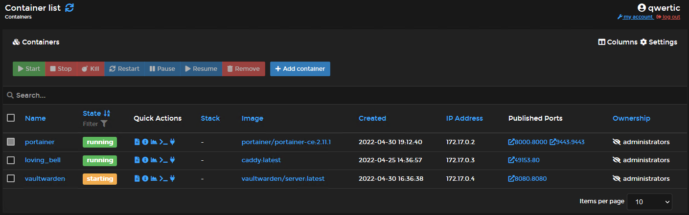

# Docker part 1: Installing vaultwarden and portainer

<!-- @import "[TOC]" {cmd="toc" depthFrom=1 depthTo=6 orderedList=false} -->

<!-- code_chunk_output -->

- [Docker part 1: Installing vaultwarden and portainer](#docker-part-1-installing-vaultwarden-and-portainer)
  - [docker-compose.yml file](#docker-composeyml-file)
  - [HowTo's](#howtos)
  - [Installing docker on Ubuntu Server LTS 20.04](#installing-docker-on-ubuntu-server-lts-2004)
  - [User and group settings](#user-and-group-settings)
  - [Installing vaultwarden](#installing-vaultwarden)
  - [Installing Portainer](#installing-portainer)
  - [Containers](#containers)
  - [Installing Compose](#installing-compose)
  - [Use docker-compose.yml to create vaultwarden and portainer container](#use-docker-composeyml-to-create-vaultwarden-and-portainer-container)
  - [Using caddy for vaultwarden SSL proxy](#using-caddy-for-vaultwarden-ssl-proxy)
    - [Installing caddy](#installing-caddy)
    - [Configuring caddy](#configuring-caddy)
  - [Result caddy](#result-caddy)
  - [Todo's](#todos)
  - [Evaluatie](#evaluatie)

<!-- /code_chunk_output -->

## docker-compose.yml file

Het docker-compose.yml bestand bewaart alle informatie over een container. 

## HowTo's

```bash

docker run -d -p [port:port] --name [container_short_name] --restart=[always] -v [docker .sock location] -v [file_location] #create docker container
docker [start / stop] [container_name] #start / stop specific   docker container
```

## Installing docker on Ubuntu Server LTS 20.04

```bash
sudo apt upgrade -y # update befor installing anything
sudo apt-get remove docker-ce docker-ce-cli containerd.io #uninstall previous docker version / files
```

```bash
 sudo apt-get install apt-transport-https ca-certificates curl gnupg-agent software-properties-common # install dependencies for install process
```

Adding Docker official GPG key

```bash
sudo curl -fsSL https://download.docker.com/linux/ubuntu/gpg | sudo apt-key add -
```

```bash
sudo apt-get update
sudo apt-get install docker-ce docker-ce-cli containerd.io -y
```

## User and group settings

```bash
sudo groupadd docker #if it doesn't exist allready
sudo usermod -aG docker $USER
newgrp docker #apply changes and refresh for current user 
docker run hello-world #running docker without sudo

Hello from Docker!
This message shows that your installation appears to be working correctly.
```

[On Debian and Ubuntu, the Docker service is configured to start on boot by default.](https://docs.docker.com/engine/install/linux-postinstall/#configure-docker-to-start-on-boot)

## Installing vaultwarden

```bash 
docker pull vaultwarden/server:latest
sudo docker run -d --name vaultwarden -v /srv/vaultwarden:/data -e WEBSOCKET_ENABLED=true -p 127.0.0.1:8080:8080 -p 127.0.0.1:3012:3012 --restart on-failure vaultwarden/server:latest
```

## Installing Portainer

```bash
docker volume create files-portainer
docker run -d -p 8000:8000 -p 9443:9443 --name portainer --restart=alway
s -v /var/run/docker.sock -v files-portainer:/data portainer/portainer-ce:2.11.1
```


## Containers



## Installing Compose

```bash
DOCKER_CONFIG=${DOCKER_CONFIG:-$HOME/.docker}
mkdir -p $DOCKER_CONFIG/cli-plugins
curl -SL https://github.com/docker/compose/releases/download/v2.2.3/docker-compose-linux-x86_64 -o $DOCKER_CONFIG/cli-plugins/docker-compose
```

```bash
qwertic@cplex:~$  docker compose version
Docker Compose version v2.4.1
```

## Use docker-compose.yml to create vaultwarden and portainer container

[Creating multiple services at once with docker-compose.yml](https://docs.microsoft.com/en-us/dotnet/architecture/microservices/multi-container-microservice-net-applications/multi-container-applications-docker-compose)

```text
version: '3'
services:
    vaultwarden:
        image: vaultwarden/server:latest
        container_name: vaultwarden
        restart: always
        environment:
            SIGNUPS_ALLOWED: 'true'
            WEBSOCKET_ENABLED: 'true'
        ports:
            - 8080:8080
            - 3012:3012
        volumes:
            - /srv/vaultwarden:/data

    portainer:
        image: portainer/portainer-ce:2.11.1
        container_name: portainer
        restart: always
        ports:
            - 8000:8000
            - 9443:9443
        volumes:
            - /var/run/docker.sock
            - /files-portainer:/data
```

```bash
qwertic@cplex:~$ docker compose up -d
[+] Running 2/2
 ⠿ Container portainer    Started                                   2.1s
 ⠿ Container vaultwarden  Running                                   0.0s
```

```bash
qwertic@cplex:~$ docker ps
CONTAINER ID   IMAGE                           COMMAND                  CREATED              STATUS                    PORTS                                                                                            NAMES
2f5065e8c337   portainer/portainer-ce:2.11.1   "/portainer"             About a minute ago   Up About a minute         0.0.0.0:8000->8000/tcp, :::8000->8000/tcp, 0.0.0.0:9443->9443/tcp, :::9443->9443/tcp, 9000/tcp   portainer
04fe3c9060e6   vaultwarden/server:latest       "/usr/bin/dumb-init …"   17 minutes ago       Up 17 minutes (healthy)   0.0.0.0:3012->3012/tcp, :::3012->3012/tcp, 80/tcp, 0.0.0.0:8080->8080/tcp, :::8080->8080/tcp     vaultwarden
```

## Using caddy for vaultwarden SSL proxy

### Installing caddy

```bash 
sudo docker pull caddy:2
```

### Configuring caddy

```text
jorisduyse.com {
  encode gzip

  # The negotiation endpoint is also proxied to Rocket
  reverse_proxy /notifications/hub/negotiate 0.0.0.0:80

  # Notifications redirected to the websockets server
  reverse_proxy /notifications/hub 0.0.0.0:3012

  # Send all other traffic to the regular Vaultwarden endpoint
  reverse_proxy 0.0.0.0:8080
}
```

## Result caddy

De caddy proxy om vaultwarden over ssl te krijgen geeft helaas een lege pagina.


## Evaluatie

```bash
docker --version #not with sudo because user should be in docker group
docker compose version #also not sudo!
docker ps #show info about docker containers
docker compose -d #start all services from docker-compose.yml file
docker compose -d [serviceName] #start specific service from docker-compose.yml file
```