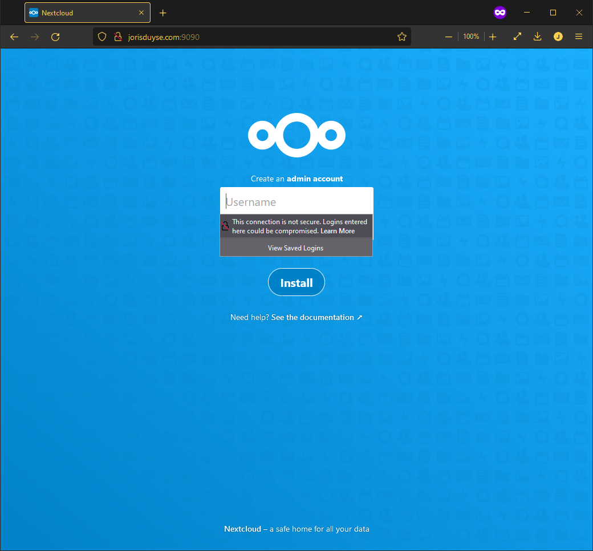
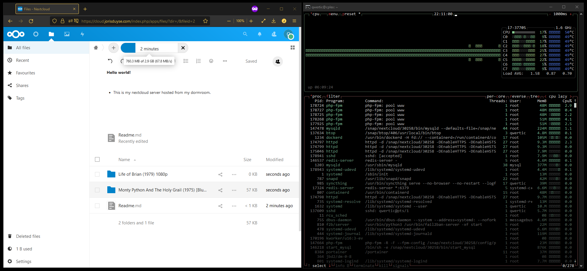

# Docker part 2

- [Docker part 2](#docker-part-2)
  - [Creating docker seceret](#creating-docker-seceret)
  - [Installing nextcloud and configuring with compose file](#installing-nextcloud-and-configuring-with-compose-file)
  - [Nextcloud installeren buiten docker](#nextcloud-installeren-buiten-docker)
    - [Adding trusted domain](#adding-trusted-domain)
  - [Allow ufw ports](#allow-ufw-ports)
  - [Setup SSl](#setup-ssl)
  - [Result](#result)
  - [Todo's](#todos)

## Creating docker seceret

```bash
 printf "**************" | docker secret create dockerP
```

## Installing nextcloud and configuring with compose file

```bash
 echo '**************' &>>nextcloud_admin_password.txt
 echo 'qwertic' &>>nextcloud_admin_user.txt
 echo '**************' &>>postgres_password.
 echo 'qwertic' &>>postgres_user.txt
 touch postgres_db.txt
```

```text
version: '3.2'

services:
  db:
    image: postgres
    restart: always
    volumes:
      - db:/var/lib/postgresql/data
    environment:
      - POSTGRES_DB_FILE=/run/secrets/postgres_db
      - POSTGRES_USER_FILE=/run/secrets/postgres_user
      - POSTGRES_PASSWORD_FILE=/run/secrets/postgres_password
    secrets:
      - postgres_db
      - postgres_password
      - postgres_user

  app:
    image: nextcloud
    restart: always
    ports:
      - 9090:80
    volumes:
      - nextcloud:/var/www/html
    environment:
      - POSTGRES_HOST=db
      - POSTGRES_DB_FILE=/run/secrets/postgres_db
      - POSTGRES_USER_FILE=/run/secrets/postgres_user
      - POSTGRES_PASSWORD_FILE=/run/secrets/postgres_password
      - NEXTCLOUD_ADMIN_PASSWORD_FILE=/run/secrets/nextcloud_admin_password
      - NEXTCLOUD_ADMIN_USER_FILE=/run/secrets/nextcloud_admin_user
    depends_on:
      - db
    secrets:
      - nextcloud_admin_password
      - nextcloud_admin_user
      - postgres_db
      - postgres_password
      - postgres_user

volumes:
  db:
  nextcloud:

secrets:
  nextcloud_admin_password:
    file: ./nextcloud_admin_password.txt
  nextcloud_admin_user:
    file: ./nextcloud_admin_user.txt
  postgres_db:
    file: ./postgres_db.txt
  postgres_password:
    file: ./postgres_password.txt
  postgres_user:
    file: ./postgres_user.txt
```

```bash 
docker compose up -d
```


Error bij het inloggen van de nextCloud server.

## Nextcloud installeren buiten docker

```bash
qwertic@cplex:~$ sudo snap install nextcloud
qwertic@cplex:~$ sudo nextcloud.manual-install qwertic *****************
Nextcloud was successfully installed
```

### Adding trusted domain

```bash
qwertic@cplex:~$ sudo nextcloud.occ config:system:get trusted_domains
localhost

qwertic@cplex:~$ sudo nextcloud.occ config:system:set trusted_domains 1 --value=cloud.jorisduyse.com
```

## Allow ufw ports

```bash
sudo ufw allow 80,443/tcp
```

## Setup SSl

```bash
sudo nextcloud.enable-https lets-encrypt
```

## Result



## Todo's

Een dedicated schijf maken voor Nextcloud.
Een proxy maken zodat apache en nextcloud samen kunnen draaien.