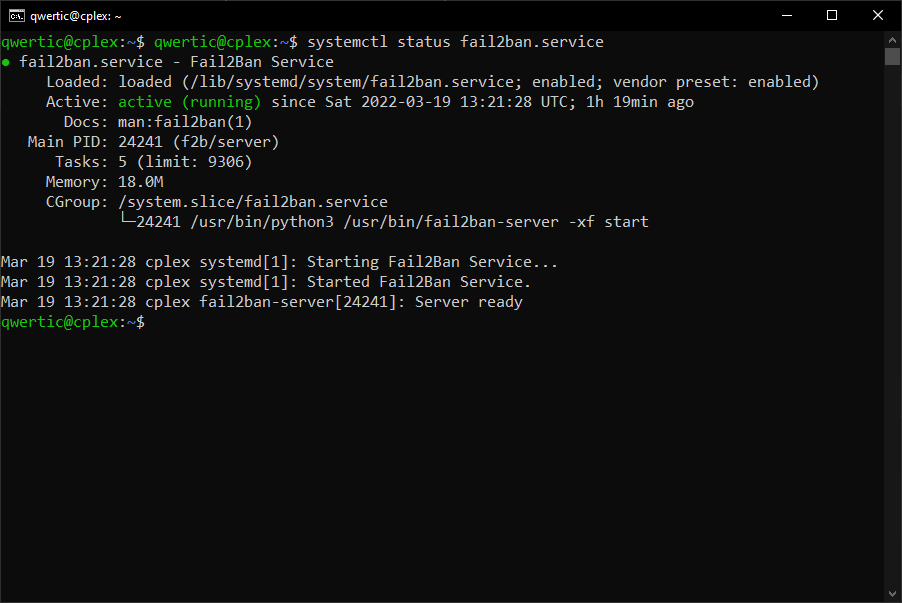
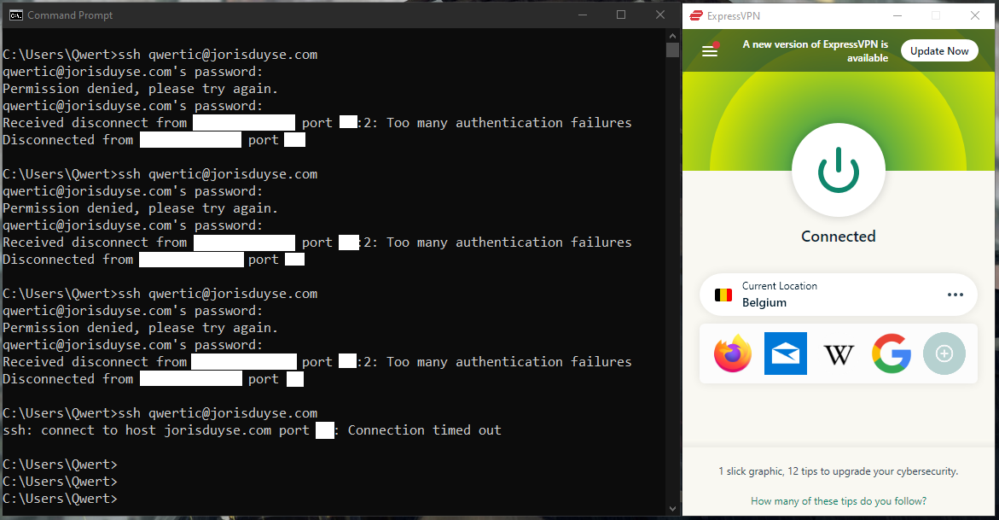
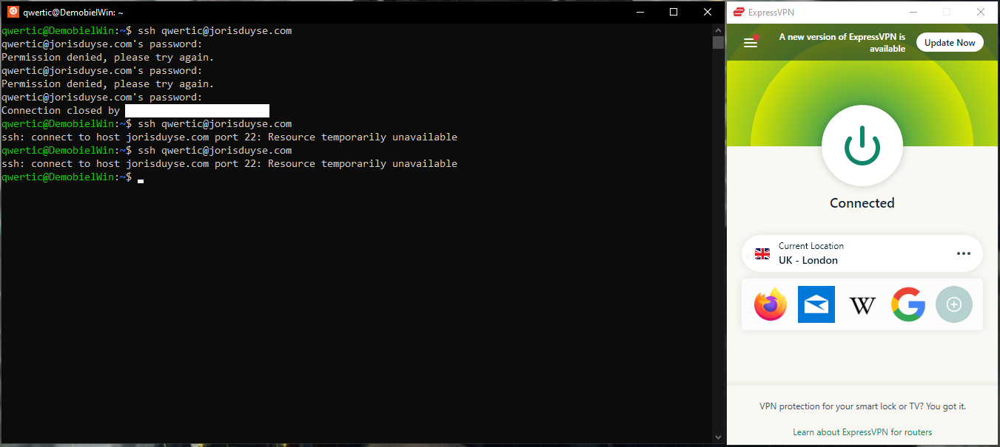
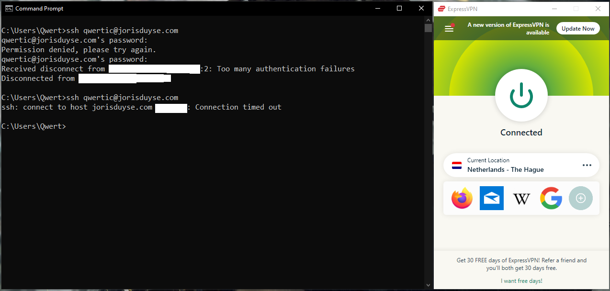
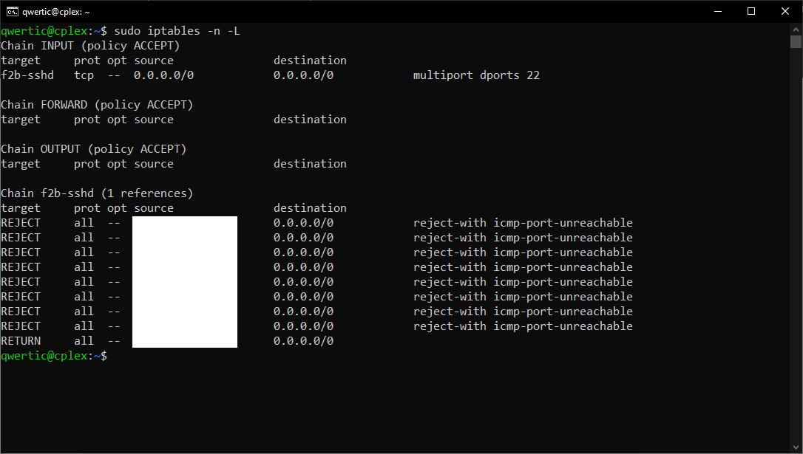

# Documentatie fail2ban installeren in virtuele omgeving en deployment on bare-metal

| Documentatie type | Link |
| ----------- | ----------- |
| Online markdown documentation | [github.com](https://github.com/JorisVanDuyseHogent/SystemEngineeringLab/tree/main/Fail2Ban#readme) |
| Online pdf documentation | [github.com](https://github.com/JorisVanDuyseHogent/SystemEngineeringLab/blob/main/Fail2Ban/Fail2BanG56.pdf) |

## Table of contents

- [Documentatie fail2ban installeren in virtuele omgeving en deployment on bare-metal](#documentatie-fail2ban-installeren-in-virtuele-omgeving-en-deployment-on-bare-metal)
  - [Table of contents](#table-of-contents)
  - [Installatie fail2ban op ubuntu server](#installatie-fail2ban-op-ubuntu-server)
  - [Configuratie fail2ban op ubuntu server](#configuratie-fail2ban-op-ubuntu-server)
    - [Findtime](#findtime)
    - [Maxretry](#maxretry)
    - [Bantime](#bantime)
  - [Configureer fail2ban opdracht](#configureer-fail2ban-opdracht)
  - [Testen van fail2ban service](#testen-van-fail2ban-service)
  - [Resultaten bans / jails](#resultaten-bans--jails)

## Installatie fail2ban op ubuntu server

```bash
sudo apt install fail2ban -y
```

## Configuratie fail2ban op ubuntu server

```bash
sudo cp jail.conf jail.local
```

### Findtime

```bash
103 # A host is banned if it has generated "maxretry" during the last "findtime"
104 # seconds.
105 findtime  = 10m
```

### Maxretry

```bash
107 # "maxretry" is the number of failures before a host get banned.
108 maxretry = 5
```

### Bantime

```bash
100 # "bantime" is the number of seconds that a host is banned.
101 bantime  = 10m
```

## Configureer fail2ban opdracht

```bash
[DEFAULT]
bantime = 15m
findtime = 3m
maxretry = 6

[sshd]
port    = ssh
logpath = %(sshd_log)s
backend = %(sshd_backend)s
```

Aangezien de service al actief was moet deze herstart worden zodat de aanpassingen in de config file kunnen worden opgenomen.

```bash
systemctl status fail2ban.service
```



```bash
$ sudo systemctl reload fail2ban.service #ssh connection crashed; sign it works?
[sudo] password for qwertic:
client_loop: send disconnect: Connection reset
```

## Testen van fail2ban service

Wanneer het ip wordt gemerkt toont ssh in **cmd** echter ```Connection timed out``` in plaats van ```ssh: connect to host server.hostname.com port 2022: Connection refused```. In **Ubuntu 20.04 on Windows** komt de error ```ssh: connect to host jorisduyse.com port 22: Resource temporarily unavailable```


*"Test wanner **maxretry** in jail.local op **6** staat"*


*"Test wanner **maxretry** in jail.local op **1** staat"*

## Resultaten bans / jails

```bash
sudo iptables -n -L #list of banned ip adresses
```


