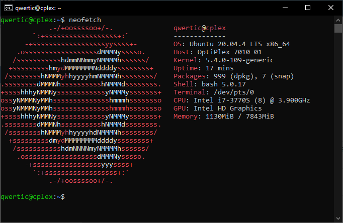
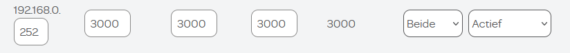
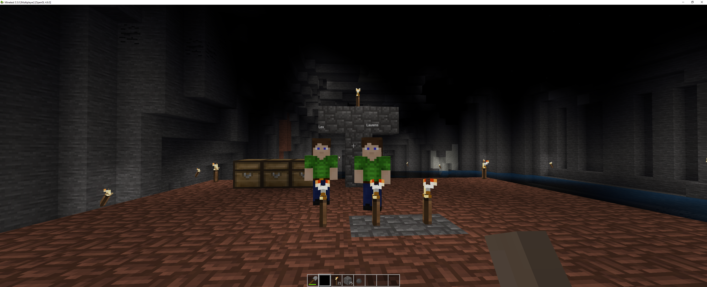

# MineTest Dedicated Server

| Documentatie type | Link |
| ----------- | ----------- |
| Online markdown documentation | [github.com](https://github.com/JorisVanDuyseHogent/SystemEngineeringLab/tree/main/MineTestServer#readme) |
| Online pdf documentation | [github.com](https://github.com/JorisVanDuyseHogent/SystemEngineeringLab/blob/main/MineTestServer/Minetest%20server%20opzetten%20G56.pdf) |

- [MineTest Dedicated Server](#minetest-dedicated-server)
  - [Dedicated and client server](#dedicated-and-client-server)
  - [Ubuntu server LTS 20.04](#ubuntu-server-lts-2004)
  - [Installing minetest server](#installing-minetest-server)
  - [Setting up minetest server](#setting-up-minetest-server)
  - [Create start script for server](#create-start-script-for-server)
  - [Portforwarding server](#portforwarding-server)
  - [Starting server](#starting-server)
  - [Launch Minetest-server at startup](#launch-minetest-server-at-startup)
  - [Joining server](#joining-server)

## Dedicated and client server

Difference between dedicated server and normal server: 

> Whilst you can host a server through the Minetest client - and this is fine for LAN games - you'll want to host a public server using the Minetest dedicated server mode [wiki.minetest.net](https://wiki.minetest.net/Setting_up_a_server#Choosing_Hardware)

## Ubuntu server LTS 20.04



## Installing minetest server

```bash
sudo apt install minetest-server -y
```

## Setting up minetest server

Config file located at: ```/etc/minetest```. Some important settings that I changed. With line number included.

```text
  37 #    Network port to listen (UDP).
  38 #    This value will be overridden when starting from the main menu.
  39 #    type: int
  40 port = 3000

  93 #    Message of the day displayed to players connecting.
  94 #    type: string
  95 motd = Welcome to the District 13 server!

 111 #    If enabled, show the server status message on player connection.
 112 #    type: bool
 113 show_statusline_on_connect = true

 128 #    New users need to input this password.
 129 #    type: string
 130 default_password = ***********
```

## Create start script for server

Startup script located in ```/home/qwertic/Minetest```.

Allow access for non root user to ```/var/log/minetest/```:
```bash
sudo chown -R qwertic:qwertic /var/log/minetest/
```

```bash
#!/bin/bash

while true
do
         /usr/games/minetestserver --gameid minetest --worldname world
        sleep 10
done
```

## Portforwarding server



## Starting server

```text
2022-05-04 12:54:52: [Main]: Using world specified by --worldname on the command line
2022-05-04 12:54:52: [Main]: Using game specified by --gameid on the command line
        .__               __                   __
  _____ |__| ____   _____/  |_  ____   _______/  |_
 /     \|  |/    \_/ __ \   __\/ __ \ /  ___/\   __\
|  Y Y  \  |   |  \  ___/|  | \  ___/ \___ \  |  |
|__|_|  /__|___|  /\___  >__|  \___  >____  > |__|
      \/        \/     \/          \/     \/
2022-05-04 12:54:52: ACTION[Main]: World at [/root/.minetest/worlds/world]
2022-05-04 12:54:52: ACTION[Main]: Server for gameid="minetest" listening on 0.0.0.0:3000.
```

## Launch Minetest-server at startup

**Using crontab:** Use command ```crontab -e```; and add ```@reboot /home/qwertic/MineTest/minetest``` to the end of the file.

**Using systemctl (doesn't seem to work):** ```systemctl enable minetest-server```

## Joining server

```text
Address: jorisduyse.com
Port: 3000
Name: qwertic
Password: **********
```

Gif not visable in pdf.


