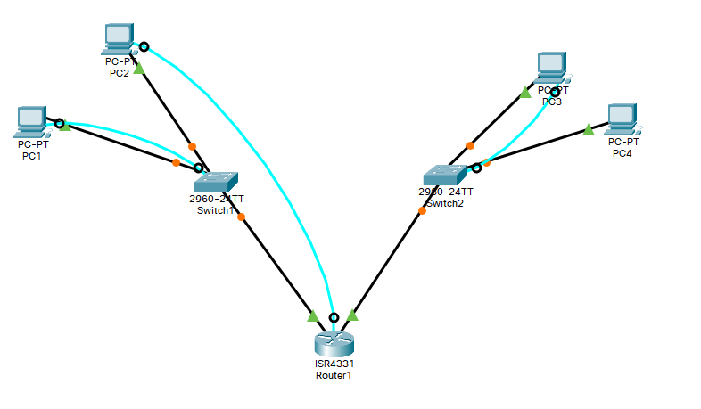
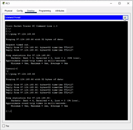
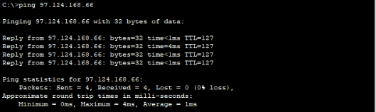

# Netwerk opzetten in Cisco Paket Tracer

- [Netwerk opzetten in Cisco Paket Tracer](#netwerk-opzetten-in-cisco-paket-tracer)
  - [Settings up Paket Tracer netword](#settings-up-paket-tracer-netword)
  - [Used resources](#used-resources)
  - [Packet tracer ping test](#packet-tracer-ping-test)
  - [IPv4 tabel](#ipv4-tabel)
  - [IPv6 tabel](#ipv6-tabel)
  - [Switch configuration](#switch-configuration)
    - [Switch S1 config](#switch-s1-config)
    - [Switch 2 config](#switch-2-config)
  - [Router config](#router-config)
    - [Ipv4 config for R0 interfaces: Gig0/0/0 and Gig0/0/1](#ipv4-config-for-r0-interfaces-gig000-and-gig001)
    - [Ipv6 config for R0 interfaces: Gig0/0/0 and Gig0/0/1](#ipv6-config-for-r0-interfaces-gig000-and-gig001)
  - [Ping test Ipv4](#ping-test-ipv4)
    - [Ipv4 ping test between PC1 and PC4](#ipv4-ping-test-between-pc1-and-pc4)
    - [Ipv4 ping test between PC2 and SW2](#ipv4-ping-test-between-pc2-and-sw2)
  - [Ping test Ipv6](#ping-test-ipv6)
    - [Ipv6 ping test between PC3 and PC4](#ipv6-ping-test-between-pc3-and-pc4)
  - [Show router interfaces](#show-router-interfaces)
    - [Gig 0/0/0 show](#gig-000-show)
    - [Gig 0/0/1 show](#gig-001-show)

## Settings up Paket Tracer netword



## Used resources

[Cisco packet tracer](https://www.netacad.com/courses/packet-tracer)

[Ip calculator](https://www.calculator.net/ip-subnet-calculator.html)

## Packet tracer ping test



Starten van een comand prompt op PC1.



## IPv4 tabel

| Toestel | Interface | Subnet | IPv4-adres | Subnetmask | IPv4-adres default gateway |
|---|---|---|---|---|---|
| PC1 | NIC | 1 | 97.124.160.69 | 255.255.248.0 | 97.124.160.1 |
| PC2 | NIC | 1 | 97.124.161.66 | 255.255.248.0 | 97.124.160.1 |
| PC3 | NIC | 2 | 97.124.168.69 | 255.255.248.0 | 97.124.168.1 |
| PC4 | NIC | 2 | 97.124.168.66 | 255.255.248.0 | 97.124.168.1 |
| SW1 | VLAN 1 | 1 | 97.124.160.200 | 255.255.248.0 | 97.124.160.1 |
| SW2 | VLAN 1 | 2 | 97.124.168.200 | 255.255.248.0 | 97.124.168.1 |
| R1 | G0/0/0 | 1 | 97.124.160.1 | 255.255.248.0 | n.v.t. |
| R1 | G0/0/1 | 2 | 97.124.168.1 | 255.255.248.0 | n.v.t. |

## IPv6 tabel

| Toestel | Interface | Subnet | IPv6-adres | Subnetmask | IPv4-adres default gateway |
|---|---|---|---|---|---|
| PC1 | NIC | 1 | fdd7:2ceb:e5c2:1::2 | /64 | FE80::1:1 |
| PC2 | NIC | 1 | fdd7:2ceb:e5c2:1::3 | /64 | FE80::1:1 |
| PC3 | NIC | 2 | fdd7:2ceb:e5c2:2::2 | /64 | FE80::2:1 |
| PC4 | NIC | 2 | fdd7:2ceb:e5c2:2::3 | /64 | FE80::2:1 |
| SW1 | VLAN 1 | 1 | fdd7:2ceb:e5c2:1::4 | /64 | FE80::1:1 |
| SW2 | VLAN 1 | 2 | fdd7:2ceb:e5c2:2::4 | /64 | FE80::2:1 |
| R1 | G0/0/0 | 1 | fdd7:2ceb:e5c2:1::1 | /64 | n.v.t. |
| R1 | G0/0/1 | 2 | fdd7:2ceb:e5c2:2::1 | /64 | n.v.t. |

## Switch configuration

### Switch S1 config

```batch
Switch>enable
Switch#conf t
Enter configuration commands, one per line.  End with CNTL/Z.
Switch(config)#int vlan 1 
Switch(config-if)#ip address 97.124.160.200 255.255.248.0
Switch(config-if)#no shutdown
%LINK-5-CHANGED: Interface Vlan1, changed state to up

%LINEPROTO-5-UPDOWN: Line protocol on Interface Vlan1, changed state to up
Switch#
%SYS-5-CONFIG_I: Configured from console by console
Switch(config)#ip default-gateway 97.124.160.1
Switch(config)#banner motd "Toegang enkel tot bevoegden"
Switch(config)#hostname sw1
Switch(config)#end

```

### Switch 2 config

```batch
Switch>enable
Switch#conf t
Enter configuration commands, one per line.  End with CNTL/Z.
Switch(config)#int vlan 1
Switch(config-if)#ip address 97.124.168.200 255.255.248.0
Switch(config-if)#no shutdown

Switch(config-if)#
%LINK-5-CHANGED: Interface Vlan1, changed state to up

%LINEPROTO-5-UPDOWN: Line protocol on Interface Vlan1, changed state to up

Switch(config-if)#ip default-gateway 97.124.168.1
Switch(config)#banner motd "Toegang enkel tot bevoegden"
Switch(config)#hostname sw2
sw2(config)#end
sw2#
%SYS-5-CONFIG_I: Configured from console by console

sw2#copy run start
Destination filename [startup-config]? 
Building configuration...
[OK]
sw2#
```

## Router config

### Ipv4 config for R0 interfaces: Gig0/0/0 and Gig0/0/1

```batch
Router>enable
Router#conf t
Enter configuration commands, one per line.  End with CNTL/Z.
Router(config)#banner motd "Toegang enkel tot bevoegden"
Router(config)#interface Gig0/0/0 
Router(config-if)#ip address 97.124.160.1 255.255.248.0
Router(config-if)#no shutdown

Router(config-if)#
%LINK-5-CHANGED: Interface GigabitEthernet0/0/0, changed state to up

%LINEPROTO-5-UPDOWN: Line protocol on Interface GigabitEthernet0/0/0, changed state to up

Router(config-if)#^Z
Router#
%SYS-5-CONFIG_I: Configured from console by console

Router#conf t
Enter configuration commands, one per line.  End with CNTL/Z.
Router(config)#interface Gig0/0/1
Router(config-if)#ip address 97.124.168.1 255.255.248.0
Router(config-if)#no shutdown

Router(config-if)#
%LINK-5-CHANGED: Interface GigabitEthernet0/0/1, changed state to up

%LINEPROTO-5-UPDOWN: Line protocol on Interface GigabitEthernet0/0/1, changed state to up

Router(config-if)#end
Router#
%SYS-5-CONFIG_I: Configured from console by console

Router#copy run start
Destination filename [startup-config]? 
Building configuration...
[OK]
```

### Ipv6 config for R0 interfaces: Gig0/0/0 and Gig0/0/1


```batch
Router>enable
Router#conf t
Enter configuration commands, one per line.  End with CNTL/Z.
Router(config)#int Gig0/0/0
Router(config-if)#ipv6 address fdd7:2ceb:e5c2:1::1/64 eui-64
Router(config-if)#^Z
Router#
%SYS-5-CONFIG_I: Configured from console by console

Router#conf t
Enter configuration commands, one per line.  End with CNTL/Z.
Router(config)#int Gig0/0/1 
Router(config-if)#ipv6 address fdd7:2ceb:e5c2:2::1/64 eui-64
Router(config-if)#end
Router#
%SYS-5-CONFIG_I: Configured from console by console

Router#copy run start
Destination filename [startup-config]? 
Building configuration...
[OK]
```

## Ping test Ipv4

### Ipv4 ping test between PC1 and PC4

When pinging the first time, the connection has to be build up and some packets are lost 25%. After this test an other ping test has 0% packets lost.

```batch
C:\>ping 97.124.168.66

Pinging 97.124.168.66 with 32 bytes of data:

Request timed out.
Reply from 97.124.168.66: bytes=32 time<1ms TTL=127
Reply from 97.124.168.66: bytes=32 time<1ms TTL=127
Reply from 97.124.168.66: bytes=32 time<1ms TTL=127

Ping statistics for 97.124.168.66:
    Packets: Sent = 4, Received = 3, Lost = 1 (25% loss),
Approximate round trip times in milli-seconds:
    Minimum = 0ms, Maximum = 0ms, Average = 0ms

C:\>ping 97.124.168.66

Pinging 97.124.168.66 with 32 bytes of data:

Reply from 97.124.168.66: bytes=32 time<1ms TTL=127
Reply from 97.124.168.66: bytes=32 time<1ms TTL=127
Reply from 97.124.168.66: bytes=32 time<1ms TTL=127
Reply from 97.124.168.66: bytes=32 time=8ms TTL=127

Ping statistics for 97.124.168.66:
    Packets: Sent = 4, Received = 4, Lost = 0 (0% loss),
Approximate round trip times in milli-seconds:
    Minimum = 0ms, Maximum = 8ms, Average = 2ms
```

### Ipv4 ping test between PC2 and SW2

When pinging the first time, the connection has to be build up and some packets are lost 50%. After this test an other ping test has 0% packets lost.

```batch
C:\>ping 97.124.168.200

Pinging 97.124.168.200 with 32 bytes of data:

Request timed out.
Request timed out.
Reply from 97.124.168.200: bytes=32 time<1ms TTL=254
Reply from 97.124.168.200: bytes=32 time<1ms TTL=254

Ping statistics for 97.124.168.200:
    Packets: Sent = 4, Received = 2, Lost = 2 (50% loss),
Approximate round trip times in milli-seconds:
    Minimum = 0ms, Maximum = 0ms, Average = 0ms

C:\>ping 97.124.168.200

Pinging 97.124.168.200 with 32 bytes of data:

Reply from 97.124.168.200: bytes=32 time<1ms TTL=254
Reply from 97.124.168.200: bytes=32 time=15ms TTL=254
Reply from 97.124.168.200: bytes=32 time<1ms TTL=254
Reply from 97.124.168.200: bytes=32 time<1ms TTL=254

Ping statistics for 97.124.168.200:
    Packets: Sent = 4, Received = 4, Lost = 0 (0% loss),
Approximate round trip times in milli-seconds:
    Minimum = 0ms, Maximum = 15ms, Average = 3ms
```

## Ping test Ipv6

### Ipv6 ping test between PC3 and PC4

```batch
C:\>ping fdd7:2ceb:e5c2:2::3

Pinging fdd7:2ceb:e5c2:2::3 with 32 bytes of data:

Reply from FDD7:2CEB:E5C2:2::3: bytes=32 time<1ms TTL=128
Reply from FDD7:2CEB:E5C2:2::3: bytes=32 time<1ms TTL=128
Reply from FDD7:2CEB:E5C2:2::3: bytes=32 time<1ms TTL=128
Reply from FDD7:2CEB:E5C2:2::3: bytes=32 time<1ms TTL=128

Ping statistics for FDD7:2CEB:E5C2:2::3:
    Packets: Sent = 4, Received = 4, Lost = 0 (0% loss),
Approximate round trip times in milli-seconds:
    Minimum = 0ms, Maximum = 0ms, Average = 0ms
```

## Show router interfaces

### Gig 0/0/0 show

```text
Router#show ipv6 interface Gig0/0/0
GigabitEthernet0/0/0 is up, line protocol is up
  IPv6 is enabled, link-local address is FE80::210:11FF:FEDC:CB01
  No Virtual link-local address(es):
  Global unicast address(es):
    FDD7:2CEB:E5C2:1:210:11FF:FEDC:CB01, subnet is FDD7:2CEB:E5C2:1::/64 [EUI]
  Joined group address(es):
    FF02::1
    FF02::1:FFDC:CB01
  MTU is 1500 bytes
  ICMP error messages limited to one every 100 milliseconds
  ICMP redirects are enabled
  ICMP unreachables are sent
  ND DAD is enabled, number of DAD attempts: 1
  ND reachable time is 30000 milliseconds
```

### Gig 0/0/1 show

```text
Router#show ipv6 interface Gig0/0/1
GigabitEthernet0/0/1 is up, line protocol is up
  IPv6 is enabled, link-local address is FE80::210:11FF:FEDC:CB02
  No Virtual link-local address(es):
  Global unicast address(es):
    FDD7:2CEB:E5C2:2:210:11FF:FEDC:CB02, subnet is FDD7:2CEB:E5C2:2::/65 [EUI]
  Joined group address(es):
    FF02::1
    FF02::1:FFDC:CB02
  MTU is 1500 bytes
  ICMP error messages limited to one every 100 milliseconds
  ICMP redirects are enabled
  ICMP unreachables are sent
  ND DAD is enabled, number of DAD attempts: 1
  ND reachable time is 30000 milliseconds
```
