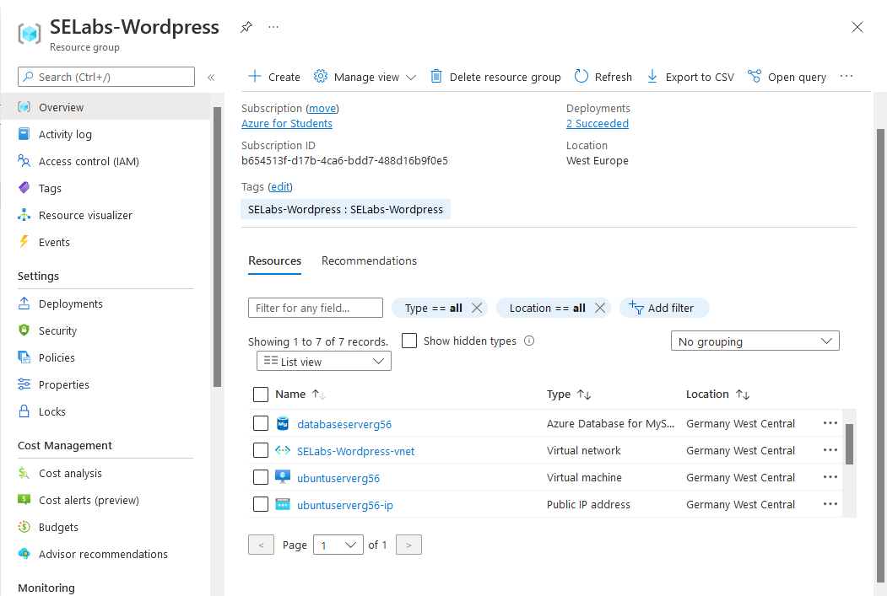
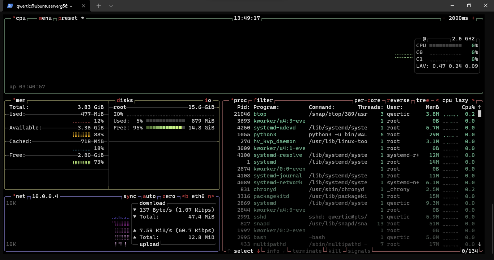
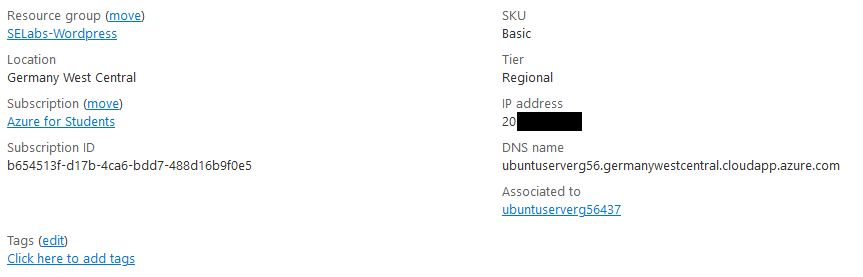
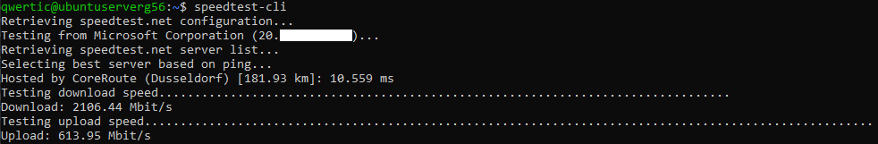
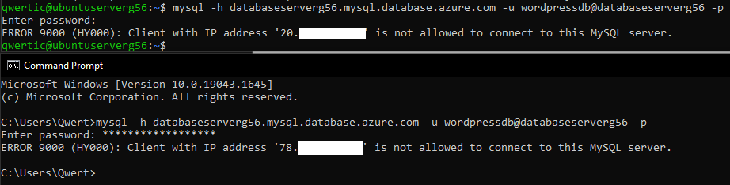
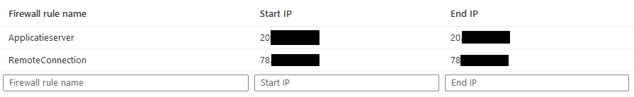
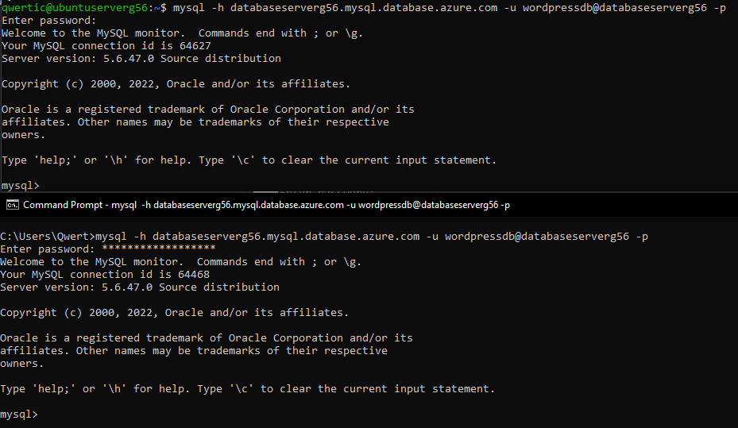
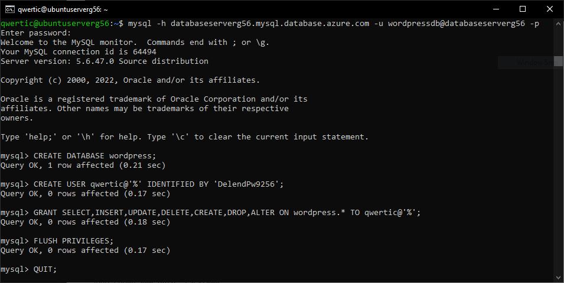
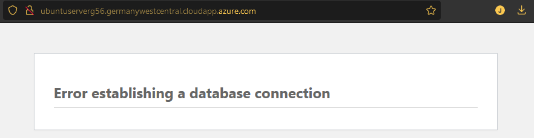
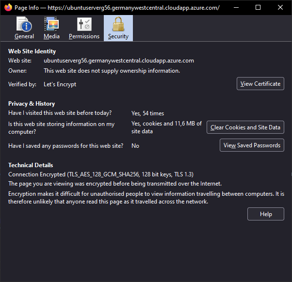

# CloudVM Database en wordpress met Microsoft Azure opzetten

- [CloudVM Database en wordpress met Microsoft Azure opzetten](#cloudvm-database-en-wordpress-met-microsoft-azure-opzetten)
  - [Installatie Databankserver](#installatie-databankserver)
  - [Verbinden met database](#verbinden-met-database)
  - [Installatie WordPress](#installatie-wordpress)
  - [Verbinding met wordpress via SSL](#verbinding-met-wordpress-via-ssl)
  - [Resultaat](#resultaat)






<p style="text-align: center; font-style: italic;">Btop op ubuntu server in MS Azure</p>


<p style="text-align: center; font-style: italic;">DNS configuratie</p>


<p style="text-align: center; font-style: italic;">Internet speedtest vanuit Azure omgeving</p>

## Installatie Databankserver

```bash
sudo apt install mysql-client -y
```

## Verbinden met database


<p style="text-align: center; font-style: italic;">Kan niet verbinden met database server via AzureUbuntu server en Windows MySQL.</p>


<p style="text-align: center; font-style: italic;">Ip exceptions voor verbinding met database. (kan ook door Star IP: 0.0.0.0; End IP: 255.255.255.255)</p>


<p style="text-align: center; font-style: italic;">Succesvolle verbinding met de database server.</p>

## Installatie WordPress

```bash
sudo apt update
sudo apt install apache2 \
                 ghostscript \
                 libapache2-mod-php \
                 php \
                 php-bcmath \
                 php-curl \
                 php-imagick \
                 php-intl \
                 php-json \
                 php-mbstring \
                 php-mysql \
                 php-xml \
                 php-zip
sudo mkdir -p /srv/www
sudo chown www-data: /srv/www
curl https://wordpress.org/latest.tar.gz | sudo -u www-data tar zx -C /srv/www
sudo nano /etc/apache2/sites-available/wordpress.conf
```

```text
<VirtualHost *:80>
    ServerName jorisduyse.com
    DocumentRoot /srv/www/wordpress
    <Directory /srv/www/wordpress>
        Options FollowSymLinks
        AllowOverride Limit Options FileInfo
        DirectoryIndex index.php
        Require all granted
    </Directory>
    <Directory /srv/www/wordpress/wp-content>
        Options FollowSymLinks
        Require all granted
    </Directory>
</VirtualHost>
```

```bash
sudo a2ensite wordpress
sudo a2enmod rewrite
sudo a2dissite 000-default
sudo service apache2 reload
```


<p style="text-align: center; font-style: italic;">Aanmaken van de wordpress database</p>

```bash
sudo service mysql start
sudo -u www-data cp /srv/www/wordpress/wp-config-sample.php /srv/www/wordpress/wp-config.php
```

Belangrijk is dat de hostname van de database wordt aangepast, en dat de KEY worden ingevuld. Bij de instructie pagina van ubuntu kon dit makkelijk met automatisch gegenereerde keys van de wordpress api.

```text
/** Database username */
define( 'DB_USER', 'qwertic' );

/** Database password */
define( 'DB_PASSWORD', '**********' );

/** Database hostname */
define( 'DB_HOST', 'databaseserverg56.mysql.database.azure.com' );

/** Database charset to use in creating database tables. */
define( 'DB_CHARSET', 'utf8' );

/** The database collate type. Don't change this if in doubt. */
define( 'DB_COLLATE', '' );
```

## Verbinding met wordpress via SSL



```php
/* Add any custom values between this line and the "stop editing" line. */
define('MYSQL_CLIENT_FLAGS', MYSQLI_CLIENT_SSL);
```

```bash
sudo snap install core; sudo snap refresh core
sudo snap install --classic certbot
sudo ln -s /snap/bin/certbot /usr/bin/certbot
```

Ik ondervond dat het belangrijk is dat deze lijnen in het wordpress-le-ssl.conf bestand stonden. Hierdoor wordt het http verkeer over poort 80 automatisch naar poort 443 (HTTPS) doorgestuurd.

```text
RewriteEngine on
RewriteCond %{SERVER_NAME} =ubuntuserverg56.germanywestcentral.cloudapp.azure.com
RewriteRule ^ https://%{SERVER_NAME}%{REQUEST_URI} [END,NE,R=permanent]
```

## Resultaat

Een wordpress site met https encryptie, SSl certificaat via Let's Encrypt en DNS via azure.com.


<p style="text-align: center; font-style: italic;">Gif niet zichtbaar in pdf</p>

